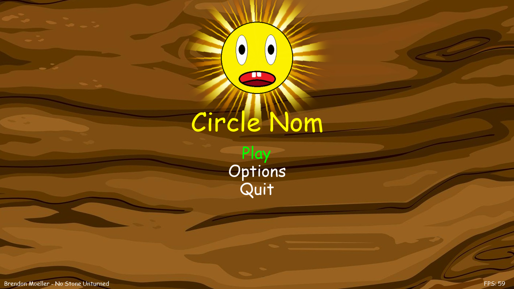
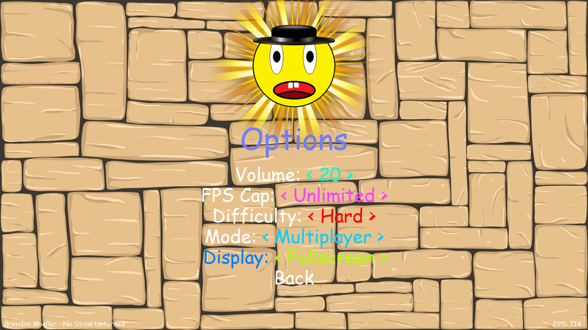
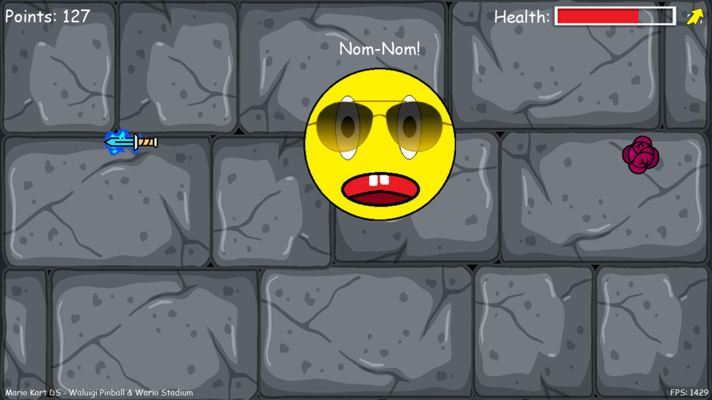
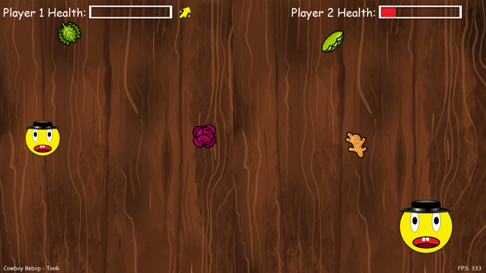

[](https://youtube.com/playlist?list=PLXh2LnVpYeGuL8rJU_m6-dzsuXGt7LOKb)

*Circle Nom is a fast-paced arcade game where you control a hungry circle trying to eat various foods while avoiding daggers. Featuring both single and multiplayer modes, customizable difficulty, and a variety of environments.*


## Table of Contents

- [Table of Contents](#table-of-contents)
- [Features](#features)
- [Goal](#goal)
- [Prerequisites](#prerequisites)
- [File structure](#file-structure)
- [Running](#running)
- [Controls](#controls)
- [Screenshots](#screenshots)
- [Contributing](#contributing)
- [Credits](#credits)
- [License](#license)

## Features

- Big variety with the game's foods, songs, backgrounds and others.
- Menus with many functions, including difficulty selection and play mode.
- Some of the in-game features are the Game Pause and song switcher. 
- Easter egg mode and many others.

## Goal

Singleplayer:
- Score as many points as possible, by eating the food.

Multiplayer:
- Survive longer than the other player, by eating more food than them.

## Prerequisites

- Python version 3.13.2
- Install required libraries:
```bash
pip install -r requirements.txt
```

## File structure
- This project uses the following file structure:
```bash
Circle-Nom/
│
├── assets/           # All static resources (images, sounds, fonts, etc.)
│   ├── images/
│   ├── sounds/
│   ├── fonts/
│   └── ...
│
├── circle_nom/       # Main game package (all Python source code)
│   ├── core/         # Core Game Loop
│   ├── models/       # Game entities (Player, Prey, Dagger, etc.)
│   ├── ui/           # Menus, HUD, overlays (Menu, Health Bar, etc.)
│   ├── systems/      # Game systems (audio, input, save/load, etc.)
│   └── helpers/      # Utility modules (functions, asset banks, profiling, etc.)
│
├── others/           # Other miscellania (README images, profiling result)
│
├── scripts/          # Build, packaging, and deployment scripts
│
├── tests/            # Unit, integration, Graph tests
│
├── requirements.txt
├── README.md
├── LICENSE
├── .gitignore
│
└── main.py           # Entry point
```

## Running

- Open the Circle-Nom folder with your preferred IDE and launch the `main.py` file.
- Download and launch the `Circle_Nom.exe` file from the [releases section](https://github.com/ExtremerBG/Circle-Nom/releases) in the project's [GitHub](https://github.com/ExtremerBG/Circle-Nom) page. You can also make your own executable by running the `main.spec` file with pyinstaller:
```bash
pyinstaller ./scripts/main.spec
```
- Please note that both executables do **not** have digital signatures, which might result in some antivirus software flagging them as malicious.

## Controls

Menus:
- Using keyboard:
  - Move up and down between options using the `W`, `S` or `↑`, `↓` keys.
  - Switch between options using the `A`, `D` or `←`, `→` keys.
  - Press `Enter` to enter the selected option.
  - Press `Escape` or `Backspace` to go back in the menus or exit Circle Nom.
- Using mouse:
  - Hover with your mouse to select an item from the menus.
  - With `M1` and `M2` being your `left` and `right` mouse buttons, use `M1` to enter normal menu items, or for slider items use `M1` & `M2` to move left and right.

In-game:
- Singleplayer:
    - Move using `W`, `A`, `S`, `D` or the `↑`, `↓`, `←`, `→` keys.
    - Dash using the `LSHIFT` or `RSHIFT` key.
    - Change the music using the `Q` & `E` keys - previous & next song.
    - Pause Circle Nom with the `P` key.
- Multiplayer:
    - Move Player 1 using the `W`, `A`, `S`, `D` keys.
    - Player 1 can dash using the `LSHIFT` key.
    - Move Player 2 using the `↑`, `↓`, `←`, `→` keys.
    - Player 2 can dash using the `RSHIFT` key.
    - Change the music using the `Q` & `E` keys - previous & next song.
    - Pause Circle Nom with the `P` key.

## Screenshots

<div align="center">
  <table>
    <tr>
      <td align="center">
        <b>Main Menu</b><br>
        
      </td>
      <td align="center">
        <b>Options Menu</b><br>
        
      </td>
    </tr>
    <tr>
      <td align="center">
        <b>Singleplayer Mode</b><br>
        
      </td>
      <td align="center">
        <b>Multiplayer Mode</b><br>
        
      </td>
    </tr>
  </table>
</div>

## Contributing

Contributions are welcome! If you'd like to help improve Circle Nom:

1. Fork the repository.
2. Create a feature branch (`git checkout -b feature/amazing-feature`).
3. Commit your changes (`git commit -m 'Add some amazing feature'`).
4. Push to the branch (`git push origin feature/amazing-feature`).
5. Open a Pull Request.

## Credits

- Music used:
  - [Circle Nom Playlist - YouTube](https://youtube.com/playlist?list=PLXh2LnVpYeGshiAfckrBB0CvswgWv08WY&si=fghVy5HBqIqqJyV8)

- Dagger images:
  - [Dagger icons created by Freepik - Flaticon](https://www.flaticon.com/free-icons/dagger)

- Dash images:
  - [Dashes icons created by Flowicon - Flaticon](https://www.flaticon.com/free-icons/dashes)

- Food images:
  - [Kale icons by AomAm - Flaticon](https://www.flaticon.com/free-icons/kale)
  - [Sandwich icons by Freepik - Flaticon](https://www.flaticon.com/free-icons/sandwich)

- Background images:
  - [Wood Texture by barudakvisual - Vecteezy](https://www.vecteezy.com/vector-art/2173386-wood-texture-background)
  - [Wood Texture by dankudraw - Vecteezy](https://www.vecteezy.com/vector-art/3343397-wood-texture-background)
  - [Wood Texture by sarance - Vecteezy](https://www.vecteezy.com/vector-art/3157015-wood-texture-background)
  - [Stone Texture by aurigae - Vecteezy](https://www.vecteezy.com/vector-art/10826187-stone-texture-background-best-for-building-material)
  - [Stone Texture by graphicsrf - Vecteezy](https://www.vecteezy.com/vector-art/447228-a-wall-made-of-stone)
  - [Stone Tiles Texture by graphicsrf - Vecteezy](https://www.vecteezy.com/vector-art/3678912-stone-tiles-texture-in-cartoon-style)
  - [Rock Pattern Texture by emiltimplaru - Vecteezy](https://www.vecteezy.com/vector-art/1838118-rock-seamless-pattern-vector-design-illustration)
  - [Wood Texture by graphicsrf - Vecteezy](https://www.vecteezy.com/vector-art/360422-texture)
  - [Wood Texture by dankudraw - Vecteezy](https://www.vecteezy.com/vector-art/2193057-wood-texture-background)
  - [Wood Texture by aksamata - Vecteezy](https://www.vecteezy.com/vector-art/3380195-old-wood-plank-background)

## License

This project is licensed under the Creative Commons Attribution-NonCommercial 4.0 International License. See the [LICENSE](./LICENSE) file for details.